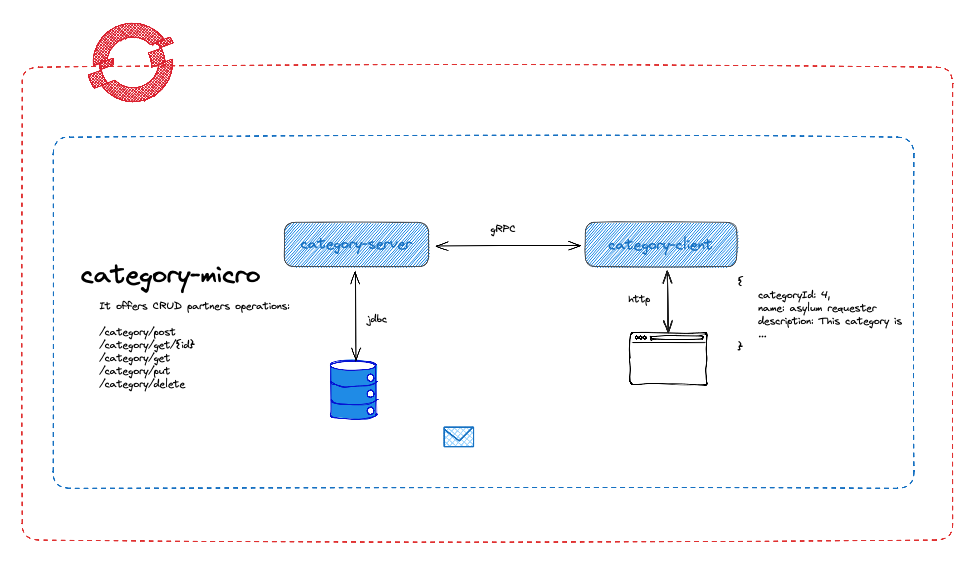
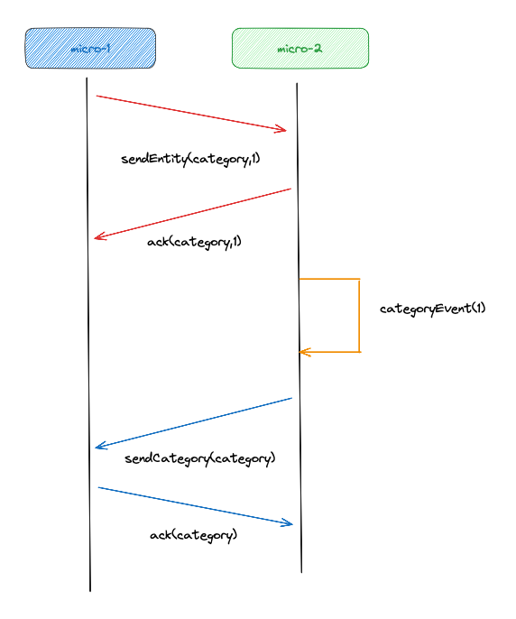

# Spring-Boot gRPC Example

## Introduction
This is a sample application demonstrating spring-boot using gRPC protocol between 2 microservices. There are several
ways of gRPC intercommunication, in this case we will use unary gRPC.

## Architecture
The architecture diagram of this solution is the following:



## gRPC Intercommunication
The intercommunication process is based on the diagram:



Steps:
1. micro1 offers a REST endpoint to initiate the communication.
2. micro1 sends gRPC request to micro2 asking for entity and id.
3. micro2 sends gRPC response accepting the communication, just ACK.
4. micro2 generates an event and using observer pattern initiates async response.
5. micro2 sends gRPC request to micro1 attaching entity and id data.
6. micro1 sends gRPC response to micro1, ACK the whole communication.

### Exposed Endpoints
The following table lists the available REST and gRPC endpoints. The [OpenAPI document](openapi-schema.yml) for the REST endpoints is also available.

| Path           | HTTP method | Response Status | Response Object | Description                                                 |
|----------------|-------------|-----------------|-----------------|-------------------------------------------------------------|
| `/entity/{id}` | `GET`       | `200`           | ACK             | Initial communication asking for an entity to be delivered. |

gRPC endpoints are exposed using protobuf, served components are linked here:

[`Category`](springboot-grpc-client/src/main/proto/category.proto)
[`Entity`](springboot-grpc-client/src/main/proto/entity.proto)


## Running Locally using Podman

In order to run it locally we need to run a postgresql container through the command:

``` shell script
podman run -d --name db-server --net test -e POSTGRES_USER=test -e POSTGRES_PASSWORD=test -e POSTGRES_DB=category -p 5432:5432 postgres:16
```

Once the postgresql container is running we can start the application by running:

``` shell script
./mvnw clean package spring-boot:run
```

